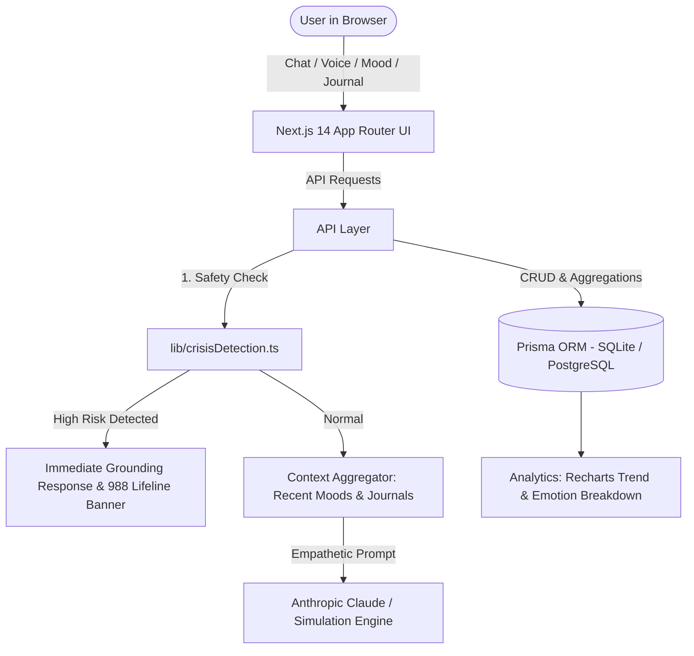

# 🌸 EMO Assistant — Mindful AI Companion & Emotional Wellness Tracker

[](https://nextjs.org/)
[](https://www.typescriptlang.org/)
[](https://tailwindcss.com/)
[](https://www.prisma.io/)
[](https://www.anthropic.com/)

> **EMO Assistant** is an empathetic, non-clinical emotional-support companion web app. It empowers users to reflect on daily feelings, track emotional intensity across time, write mindful journals with automated AI reflections, and receive immediate crisis safety de-escalation with 24/7 hotline resources.

---

## 🌟 Key Features

- 💬 **Conversational AI Companion**: Warm, validating dialogue with strict non-clinical boundaries, max 1 gentle question per turn, and contextual awareness of recent moods/journals.
- 🎙️ **Voice Integration (STT / TTS)**: Hands-free speech recognition (Speech-to-Text) and natural read-aloud playback via the Web Speech API.
- 🛡️ **Crisis Safety Engine**: Automated risk classification screening before AI turn generation with immediate grounding responses and **988 Suicide & Crisis Lifeline** action cards.
- 🌿 **Daily Mood Check-in**: 10-point emotional intensity slider, 10 primary emotional states, contextual tags (*Work, Sleep, Social, Mindfulness*), and chronological history.
- 📖 **Mindful Journal & AI Insights**: Reflection writing area with prompt suggestions, automatic sentiment tagging, and strength-focused AI reflections.
- 📊 **Wellness Analytics Dashboard**: Interactive area curves for mood intensity over time, emotion distribution bar charts, and check-in streak tracking powered by **Recharts**.

---

## 🏛️ High-Level Architecture



---

## 📁 File Structure

```
emo-assistant/
├── app/
│   ├── layout.tsx                     # Global Root Layout with Navbar & Footer
│   ├── page.tsx                       # Calming Landing Hero Page
│   ├── (main)/
│   │   ├── chat/page.tsx              # Conversational Assistant UI
│   │   ├── mood/page.tsx              # Daily Mood Tracker & Check-in History
│   │   ├── journal/
│   │   │   ├── page.tsx               # Mindful Journal Feed & Editor
│   │   │   └── [id]/page.tsx          # Single Reflection View + AI Insights
│   │   ├── dashboard/page.tsx         # Analytics Charts & Streaks
│   │   └── settings/page.tsx          # Persona & Safety Preferences
│   └── api/
│       ├── chat/route.ts              # Claude Chat with Context & Safety Gate
│       ├── crisis-check/route.ts      # Risk Screening Endpoint
│       ├── mood/route.ts              # Mood Check-in CRUD
│       ├── journal/route.ts           # Journal CRUD with AI Reflection Generation
│       ├── journal/[id]/route.ts      # Single Journal Management
│       └── analytics/route.ts         # Aggregations for Charts & Trends
│
├── components/
│   ├── chat/
│   │   ├── ChatWindow.tsx             # Full Chat Interface with Suggested Prompts
│   │   ├── MessageBubble.tsx          # Message Bubble with TTS & Emotion Badges
│   │   └── VoiceInputButton.tsx       # Web Speech Recognition Mic Button
│   ├── mood/
│   │   ├── MoodSelector.tsx           # Emoji Picker + Intensity Slider (1-10)
│   │   └── MoodHistoryCard.tsx        # History Timeline Cards
│   ├── journal/
│   │   ├── JournalEditor.tsx          # Writing Area with Instant AI Reflection
│   │   └── JournalList.tsx            # Reflection Feed & Sentiment Tags
│   ├── dashboard/
│   │   ├── MoodTrendChart.tsx         # Recharts Area Curve
│   │   └── EmotionBreakdown.tsx       # Recharts Bar & Pie Charts
│   ├── crisis/
│   │   └── CrisisResourceBanner.tsx   # 24/7 Hotline Cards (988, 741741, Trevor)
│   └── ui/
│       └── Navbar.tsx                 # Navigation with Quick Crisis Helpline Trigger
│
├── lib/
│   ├── anthropic.ts                   # Claude SDK Wrapper + Local Fallback Engine
│   ├── prisma.ts                      # Prisma Singleton
│   ├── user.ts                        # User Management & Seed Initialization
│   ├── crisisDetection.ts             # Risk Screening & Severity Classifier
│   ├── sentiment.ts                   # Emotion & Tone Analysis
│   └── prompts/
│       ├── systemPrompt.ts            # Non-Clinical Mindful Companion Persona
│       ├── journalReflectionPrompt.ts # Validating Journal Takeaways Prompt
│       └── crisisResponsePrompt.ts    # De-escalation & Lifeline Response Prompt
│
├── prisma/
│   └── schema.prisma                  # Database Schema (User, Mood, Journal, Chat)
└── types/
    └── index.ts                       # Domain TypeScript Interfaces
```

---

## 🚀 Getting Started

### 1. Prerequisites
- [Node.js](https://nodejs.org/) (v18.17+ or v20+)
- npm / yarn / pnpm

### 2. Installation
```bash
git clone https://github.com/RamaVenkataCharan/Emo_Assist.git
cd Emo_Assist
npm install
```

### 3. Setup Environment Variables
Create a `.env` file in the root directory:
```env
DATABASE_URL="file:./dev.db"
ANTHROPIC_API_KEY="" # Optional in dev: built-in companion engine handles offline/demo mode
```

### 4. Initialize Database
```bash
npx prisma db push
```

### 5. Run Locally
```bash
npm run dev
```
Open [http://localhost:3000](http://localhost:3000) in your browser.

---

## 🛡️ Non-Clinical Safety & Ethical Boundaries
EMO Assistant is built strictly for emotional self-reflection and personal wellness:
- **No Medical Diagnosis**: Never diagnoses medical/mental health conditions.
- **No Artificial Dependency**: Encourages human connection and professional therapy.
- **24/7 Free Crisis Support**: Immediate de-escalation and direct routing to **988 Lifeline** (US/Canada), **Crisis Text Line** (`741741`), and **The Trevor Project**.

---

## 📄 License
This project is open-source and available under the [MIT License](LICENSE).
